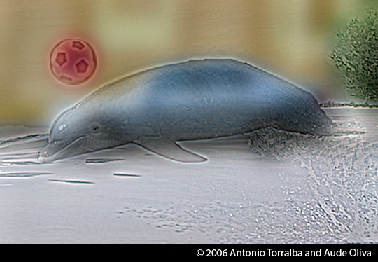
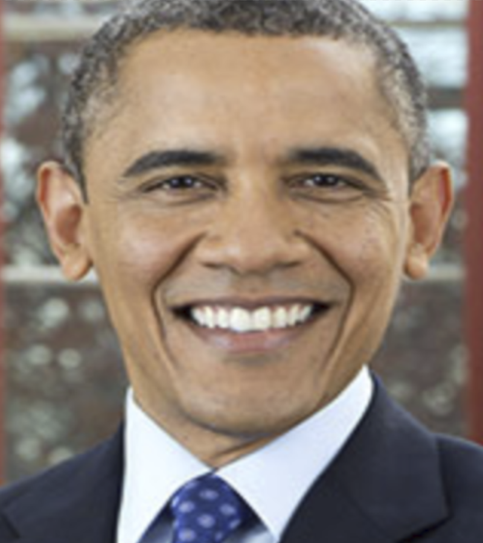
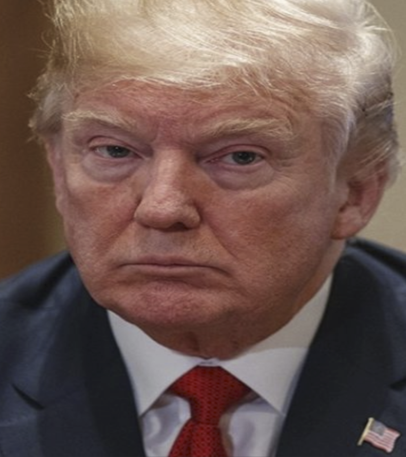
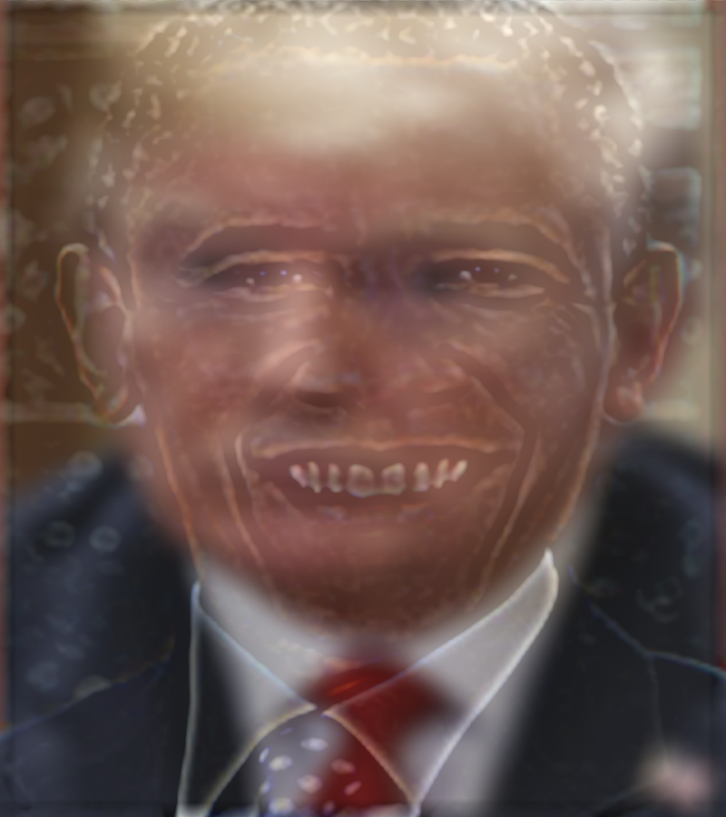
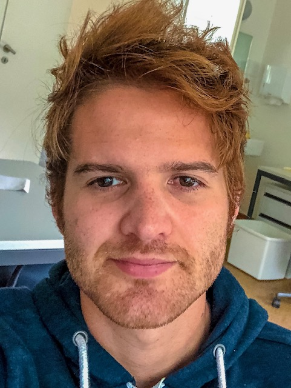
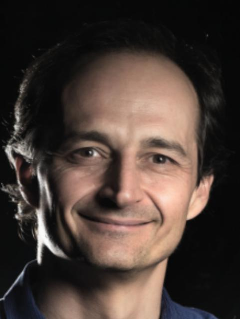
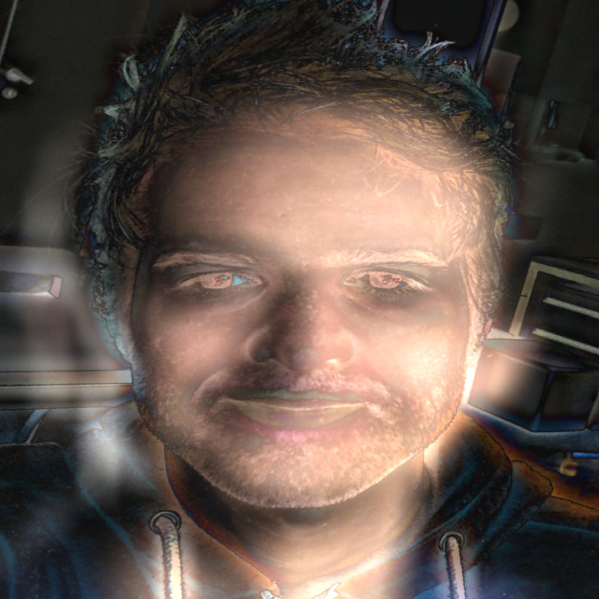
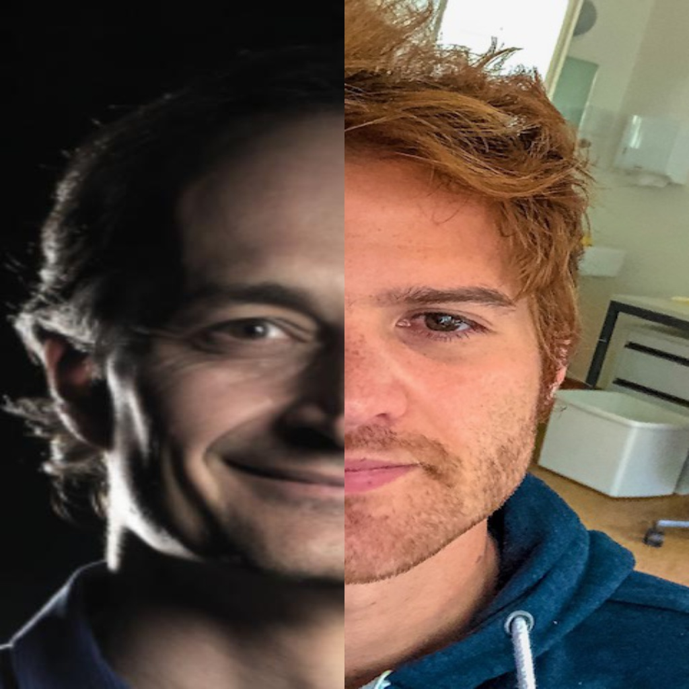
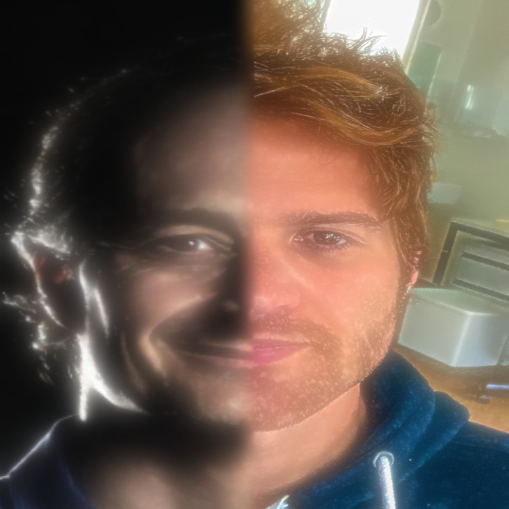

# Hybrid images

## Source

This lab is based on:

- http://cs.brown.edu/courses/cs143/proj1/
- https://courses.engr.illinois.edu/cs498dh3/fa2014/projects/hybrid/ComputationalPhotography_ProjectHybrid.html
- http://cvcl.mit.edu/publications/OlivaTorralb_Hybrid_Siggraph06.pdf

## Examples

Notice how the folowing images look different when viewed from far (or zoomed out), than when looking at close range (or zoomed in).

Another example from two pictures:

Or, yours truly:

## Short Introduction

*Hybrid images* are made from two images. A low pass filter is applied to one of them, and a high pass filter to the other. After merging the filtered images into a single image, from a close distance the high pass filtered image (small details) dominates; from far away the low pass filtered (Broad patterns) one dominates. This effect works best when images are aligned and share slightly similar visual information.

## Exercise

### Start with good images 

The data folder (originally downloaded from [here](http://cs.brown.edu/courses/cs143/proj1/)) contains several pairs of aligned images. Choose one pair (not any pair, be sure the images look similar), and load both  into matlab.

### Filtering
Matlab:
Use [imfilter](http://www.mathworks.com/help/images/ref/imfilter.html) to apply a low pass filter to one image.

Python:
You might use for instance `OpenCV`, `scipy` or any module you find appropiate.

To create the high-pass filtered image, apply a low pass filter to it, and then subtract it from the original image. Mathematically: *Y = X - f(X)* , where *X* is the input image and *f* is the low pass filter. Be careful as the image *Y* will likely contain negative values.

You might also use the frequency representation of the image (i.e. Fourier transform) and operate directly on the frequency domain; This might provide better results. Check [fft](http://www.mathworks.com/help/matlab/ref/fft2.html) and [dct](http://www.mathworks.com/help/images/ref/dct2.html).

### Creating a hybrid image

The hybrid image is created by adding the two filtered images:

*H = L(X1,T1) + (X2 - L(X2,T2) )*

Where *L* is a low pass filter, and *X1* and *X2* are the input images. Notice that the effect depends on the cut-off frequencies *T1* and *T2* of both filters (see figure 5 of the [Hybrid Images paper](http://cvcl.mit.edu/publications/OlivaTorralb_Hybrid_Siggraph06.pdf)). Additionally, you may scale the amplitude of one of the images to reduce or increase its impact. Play with this parameters to get a good Hybrid Image.

### Visualization

In order to approximate how the image would look from different distances we can use a pyramid (see figure at the bottom of http://cs.brown.edu/courses/cs143/proj1/ ).

### Creating a blended image

In this section you need to play with the Gaussian Pyramid as well as the Laplacian Pyramid.
 - **Gaussian Pyramid**: Apply Gaussian filter over image, then downsample it by a factor of 2. 

     Pseudocode: 

	`pyramid_down = downsampling(gauss_filter(image), factor=2)`

	`pyramid_up = upsampling(gauss_filter(image), factor=2)`

 - **Laplacian Pyramid**: A level in Laplacian Pyramid is formed by the difference between that level in Gaussian Pyramid and expanded version of its upper level in Gaussian Pyramid. 

     Psudocode: 

	`Subtract(image, pyramid_up(pyramid_down(image)))` 

     _((Watch out how negative values are handled))_

In order to create a blended image:
  1. Merge (concatenate halves) the two images in a low resolution pyramid.
  2. Gaussian Pyramid up.
  3. Add the corresponding Laplacian Pyramid.
  4. Repeat 2-3 until reach optimal size. 

**Without/with pyramid blending:**

## Your Turn

Create a hybrid image based on images from *your own* collection. Some ideas are

- Memes.
- You or people you know.
- Pets.
- Pictures of the university or the city.
- Pictures of places you have visited (preferably some well known places).

Be creative and **avoid images downloaded from internet**

Remember that you will have to *align and probably crop* the images to get a better effect. To do this you may use image editing software like gimp or photoshop (Matlab if you feel brave enough). You are free to do any additional processing that you want in order to improve the effect. Also take some time to think how to deal with color images.

### Report

Include in your report the following information:

- The original images.
- A short description of each image (no more than one paragraph each).
- A description of the modifications made to the original images (crops, scaling, color modifications, etc). Along with the output of this process. 
- If you had to capture new images just for this lab, please describe if you took any special measure.
- The final hybrid image.
- The pyramid (use 4 scales at least).
- The pyramid blending.
- Code snippets where you explain only the most important aspects of the code you developed.

The report should have max 4 pages, use the first two for the heading and the sections: abstract (optional), introduction, materials and methods, results, conclusions and references. Use the final 2 pages **only** for images and code snippets (that is, if you need them).

Finally, do not forget to upload the report to your github repository, along with the full code you used.

### Deadline
**February 21 11:59 PM**

